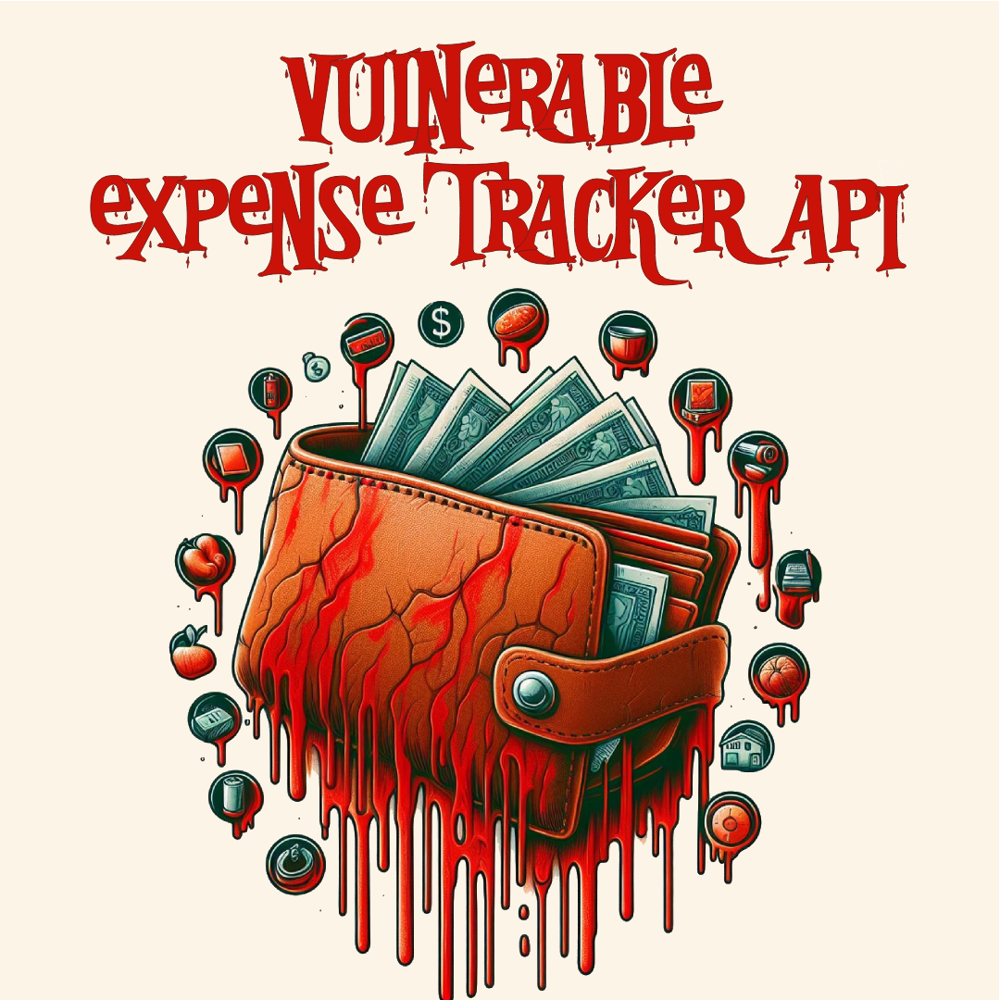
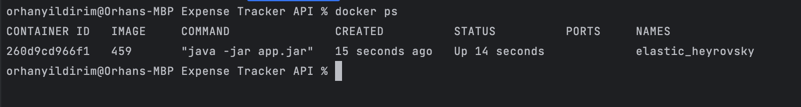
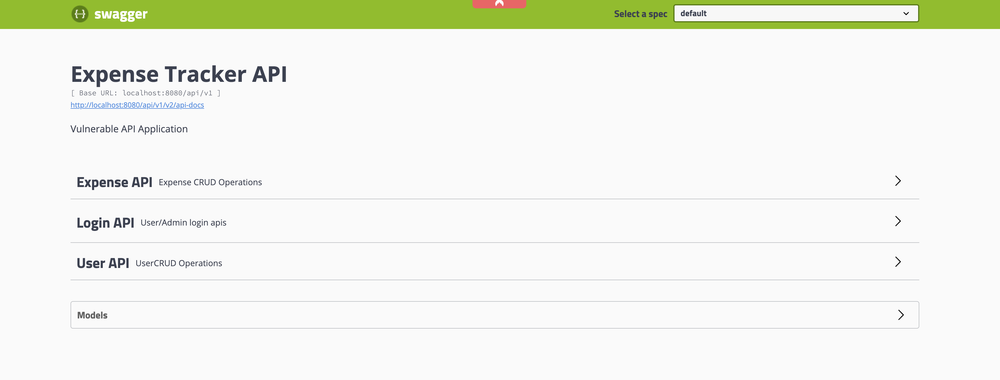
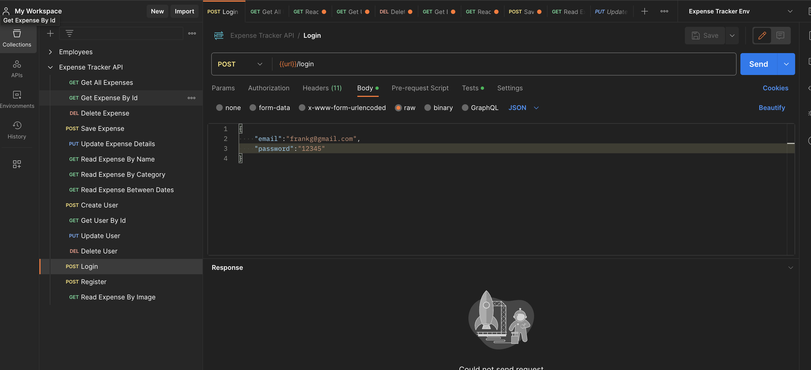

# Vulnerable Expense Tracker API

  

## Syllabus
- [Description](#description) 
- [Features](#features)
- [Learning Objectives](#learning-objectives)
- [Installation and Setup](#installation-and-setup)
- [Swagger Documentation](#swagger-documentation)
- [Postman Collection & Environment](#postman-collection--environment)

## Description 
The Vulnerable Expense Tracker API serves as a purpose-built application designed to expose various security vulnerabilities commonly encountered in real-world APIs. This intentionally vulnerable API is a valuable resource for API security professionals, penetration testers, and developers seeking to enhance their understanding of potential threats and security best practices.

This Vulnerable Expense Tracker API serves as a valuable educational tool, empowering API security professionals to hone their skills and enhance their ability to secure APIs in real-world applications.
                                 


## Features
1. IDOR (Insecure Direct Object Reference): The API deliberately includes three distinct cases of Insecure Direct Object Reference vulnerabilities, providing a practical scenario to explore and understand this common threat.

2. Rate Limiting Issues: Explore vulnerabilities related to rate limiting and understand the potential risks associated with inadequate rate control mechanisms.

3. SSRF (Server-Side Request Forgery): The API contains vulnerabilities in both request body and URI, allowing security professionals to delve into the intricacies of SSRF attacks.

4. Sensitive Information Exposure: Identify and analyze scenarios where sensitive information is inadvertently exposed in HTTP responses, emphasizing the importance of proper data protection.

5. Misconfigured HTTP Headers: Understand the impact of misconfigured HTTP headers on security and learn how to identify and mitigate such issues.

6. JWT (JSON Web Token) Vulnerabilities: Uncover weaknesses related to the use of JSON Web Tokens, including potential exploits and best practices for secure implementation.

7. Business Logic Data Validation: Explore vulnerabilities arising from inadequate validation of business logic, shedding light on the significance of robust data validation practices.

8. Improper Error Handling: Investigate the consequences of improper error handling and the potential security risks associated with revealing too much information in error responses.

## Learning Objectives:
Gain hands-on experience in identifying and exploiting common API vulnerabilities.

Understand the impact of insecure API practices on overall system security.
Learn how to implement secure coding practices to mitigate potential threats.

## Installation and Setup:
1. Clone the repository
```shell
git clone https://github.com/badchars/VulnerableExpenseTrackerAPI.git
```
2. Docker Compose
```shell
cd cd ExpenseTrackerAPI/ 
docker-compose up 
```
3. Check docker container for up and running


4. After successfully executing docker compose yml you should access the application on http://localhost:8080/api/v1. For create a test user to begin working on this app, you need to call `/register` endpoint. 


## Swagger Documentation
Comprehensive Swagger documentation is available, providing API security professionals with insights into the various endpoints, request payloads, and expected responses.

http://localhost:8080/api/v1/swagger-ui.html#/


  


## Postman Collection & Environment
A dedicated Postman collection and environment are provided, facilitating interactive testing and exploration of the API vulnerabilities.

You can find the [postman collection](/Expense%20Tracker%20API.postman_collection.json) and [postman environment](/Expense%20Tracker%20Env.postman_environment.json) in the repository.

  
